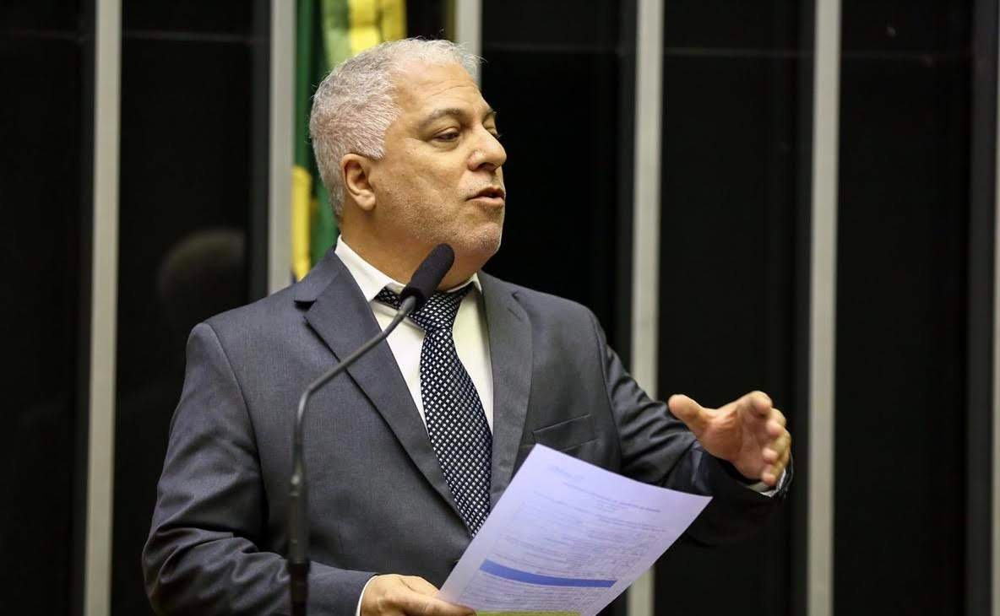

::: {.hero}
::: {.hero-content}
# Ricardo Custódio

## Professor · Researcher · Advisor

I work on the foundations and infrastructures of **digital trust**: cryptography, digital signatures, electronic documents, public-key infrastructure, electronic identity, post-quantum security, finite-field arithmetic, and security for artificial-intelligence agents.

My research connects mathematical foundations with architectures, technological artifacts, and real-world trust ecosystems.

::: {.hero-actions}
[About me](about/){.btn .btn-primary}
[Research](research/){.btn .btn-outline-primary}
[Publications](../publications.qmd){.btn .btn-outline-primary}
:::

::: {.academic-links}
[ORCID](https://orcid.org/0000-0001-9611-5694) ·
[Lattes](http://lattes.cnpq.br/9716092379282146) ·
[Google Scholar](https://scholar.google.com/citations?user=l29lg_IAAAAJ&hl=en) ·
[GitHub](https://github.com/rfcustodio) ·
[LinkedIn](https://www.linkedin.com/in/rfcustodio/)
:::
:::

::: {.hero-photo}
{fig-alt="Ricardo Custódio"}
:::
:::

::: {.home-intro}
## Research

My research asks a broad question: **how can computation be made trustworthy?**

This question has guided work on cryptographic mechanisms, secure electronic documents, digital signatures and PKI, electronic identity, post-quantum transition, and, more recently, identity and authorization for AI agents.

[Explore the research program →](research/)
:::

::: {.home-research-grid}

::: {.home-topic-card}
### Cryptography & Finite Fields

Cryptographic protocols, implementation foundations, binary extension fields, irreducible polynomials, and efficient arithmetic.

[Research →](/en/research/#research-foundations)
:::

::: {.home-topic-card}
### Digital Signatures & PKI

Digital signatures, certificates, trust infrastructures, hardware security modules, signature policies, and long-term verification.

[Research →](/en/research/#digital-trust)
:::

::: {.home-topic-card}
### Identity & Electronic Documents

Electronic identity, credentials, authentication, authorization, document authenticity, confidentiality, provenance, and preservation.

[Research →](/en/research/#electronic-identity)
:::

::: {.home-topic-card}
### Post-Quantum Security

Migration of certificates, protocols, identity systems, signatures, and long-lived electronic evidence to post-quantum cryptography.

[Research →](/en/research/#post-quantum-cryptography)
:::

::: {.home-topic-card}
### AI, Agents & Digital Trust

Identity, delegation, authorization, accountability, and auditability for autonomous and semi-autonomous AI agents.

[Research →](/en/research/#artificial-intelligence-security)
:::

:::

::: {.home-collections}
## Explore the Academic Record

The site is organized as a set of connected academic collections rather than as a single curriculum vitae.

::: {.home-collection-grid}

::: {.home-collection-card}
### Publications
Scholarly publications, selected works, and research areas.

[Browse publications →](../publications.qmd)
:::

::: {.home-collection-card}
### Projects
Research projects and technological development across different periods.

[Browse projects →](../projects.qmd)
:::

::: {.home-collection-card}
### Supervision
Master's and doctoral research and the academic genealogy around LabSEC.

[Browse supervision →](../supervision.qmd)
:::

::: {.home-collection-card}
### Software & Data
Research software, prototypes, reference implementations, and technological artifacts.

[Browse software & data →](../software.qmd)
:::

::: {.home-collection-card}
### Books & Texts
Books, technical texts, reports, and longer-form academic material.

[Browse books & texts →](../books.qmd)
:::

::: {.home-collection-card}
### Teaching
Courses, teaching trajectory, and selected educational resources.

[Browse teaching →](../teaching.qmd)
:::

::: {.home-collection-card}
### Talks
Selected talks, presentations, workshops, and historical speaking record.

[Browse talks →](../talks.qmd)
:::

::: {.home-collection-card .archive-card}
### Academic Archive
A historical view connecting research themes, projects, publications, software, students, texts, and talks.

[Explore the archive →](../archive.qmd)
:::

:::
:::

::: {.home-trajectory}
## From Engineering to Digital Trust

My academic trajectory began in electrical engineering and industrial automation, moved through scientific computing and cryptography, and developed into a long-term research program on computer security and digital trust.

Since 2000, much of this work has been developed through the **Laboratory for Computer Security (LabSEC)** at the Federal University of Santa Catarina, combining research, student supervision, and technological development.

[Read the academic trajectory →](about/)
:::

::: {.home-archive-callout}
## An Academic Memory, Not Only a Website

This site is designed as a long-term scholarly record. Publications are only one part of that record. Projects, software, technical texts, courses, talks, supervision, and unfinished research directions also document how ideas develop over time.

The **Academic Archive** connects these records into historical periods and research genealogies.

[Enter the Academic Archive →](../archive.qmd)
:::
